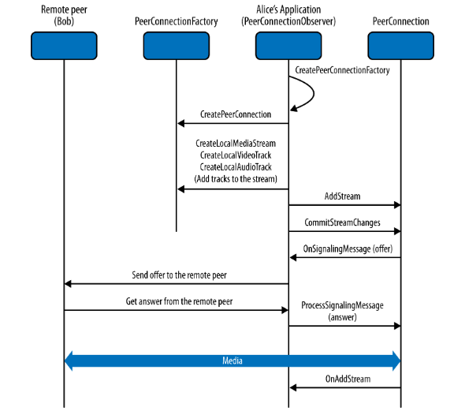

### WebRTC

传统的web架构是基于client-server范式，浏览器发送http请求给服务器，服务器返回相对一的请求信息。服务器将资源与URI和URL绑定，便于客户端通过统一的格式进行资源请求。

WebRTC 通过在浏览器之间引入对等通信范式来扩展客户端-服务器语义。一般的 WebRTC 架构模型（见图 1-1）。

图 1-1. WebRTC架构

在 WebRTC 架构模型中，两个浏览器都运行一个 Web 应用程序，该应用程序是从不同的 Web 服务器下载的。signaling消息用于建立和终止通信。它们由 HTTP 或 WebSocket 协议通过 Web 服务器传输，这些服务器可以根据需要修改、翻译或管理它们。至于数据路径，PeerConnection 允许媒体直接在浏览器之间流动，而无需任何中间服务器。两个 Web 服务器可以使用标准signaling协议进行通信。

WebRTC API 提供广泛的功能，例如连接管理（以对等方式）、编码/解码能力协商、选择和控制、媒体控制、防火墙和 NAT 元素遍历等.其中NAT功能是实现应用间端对端通信最重要的部分。

>**Network Address Translator (NAT)**  网络地址转换器 (NAT) 是用来缓解 IPv4 地址的稀缺和枯竭的标准化做法。位于私有本地网络边缘的 NAT 设备负责维护私有本地 IP 和端口元组到一个或多个全局唯一公共 IP 和端口元组的表映射。这允许 NAT 后面的本地 IP 地址在许多不同的网络中重复使用，从而解决 IPv4 地址耗尽问题。

WebRTC通过网络传输连续、实时的数据流，以便允许两个浏览器之间的直接通信，而路径上没有其他中介。比如在两个浏览器之间的实时音频和视频通话场景下，通信可能涉及两个浏览器之间的直接媒体流，媒体路径通过涉及以下实体的复杂交互序列协商和实例化，如图 1-3.

图 1-3. 浏览器中的实时通信

- 浏览器caller和JavaScript 应用程序caller（例如，通过提到的 JavaScript API）
- JavaScript 应用程序caller和应用程序provider（通常是 Web 服务器） 
- 应用程序provider和 JavaScript 应用程序的被调用者
-  JavaScript 应用程序的被调用者和被调用者浏览器

### Signaling
WebRTC 设计背后的总体思路是完全指定如何控制媒体层，同时尽可能将Signaling层留给应用层，因为应用程序可能更喜欢使用不同的标准化信令协议。Session信息包含了需要交换的最重要的信息。它指定了传输（和交互式连接建立 [ICE]）信息，以及建立媒体路径所需的媒体类型、格式和所有相关的媒体配置参数。

### MediaStream
MediaStream 是音频和/或视频的实际数据流的抽象表示。它用作管理媒体流上的操作的句柄，例如显示流的内容、记录它或将其发送到远程对等点。媒体流可以扩展为表示来自（远程流）或发送到（本地流）远程节点的流。 

LocalMediaStream 表示来自本地媒体捕获设备（例如，网络摄像头、麦克风等）的媒体流。要创建和使用本地流，Web 应用程序必须通过 getUserMedia() 函数请求用户访问。应用程序指定需要访问的媒体类型（音频或视频）。浏览器界面中的设备选择器用作授予或拒绝访问的机制。一旦应用程序完成，它可以通过调用 LocalMediaStream 上的 stop() 函数来撤销自己的访问权限。

媒体平面信令在对等体之间带外执行；安全实时传输协议 (SRTP) 用于携带媒体数据以及 RTP 控制协议 (RTCP) 信息，用于监控与数据流相关的传输统计信息。 DTLS 用于 SRTP 密钥和关联管理。

如图 1-4 所示，在多媒体通信中，每个媒体通常在一个单独的 RTP 会话中承载，带有自己的 RTCP 数据包。然而，为了克服为每个使用的流打开一个新的 NAT 漏洞的问题，IETF 目前正在研究减少基于 RTP 的实时应用程序消耗的传输层端口数量的可能性。这个想法是在单个 RTP 会话中组合（即多路复用）多媒体流量。

图 1-4. WebRTC协议栈

### PeerConnection
PeerConnection 允许两个用户直接通信，浏览器到浏览器。然后它表示与远程对等点的关联，该对等点通常是在远程端运行的同一 JavaScript 应用程序的另一个实例。通过 Web 服务器页面中的脚本代码提供的信号通道协调通信，例如，使用 XMLHttpRequest 或 WebSocket。一旦建立了对等连接，媒体流（本地与 ad hoc 定义的 MediaStream 对象相关联）可以直接发送到远程浏览器。

> **STUN and TURN**
>   用于 NAT 的会话遍历实用程序 (STUN) 协议 (RFC5389) 允许主机应用程序发现网络上存在网络地址转换器，并在这种情况下为当前连接获取分配的公共 IP 和端口元组.为此，该协议需要配置的第三方 STUN 服务器的帮助，该服务器必须位于公共网络上。 Traversal Using Relays around NAT (TURN) 协议 (RFC5766) 允许 NAT 后面的主机从位于公共 Internet 上的中继服务器获取公共 IP 地址和端口。由于中继的传输地址，主机可以从任何可以将数据包发送到公共互联网的对等方接收媒体。

PeerConnection 机制使用 ICE 协议与 STUN 和 TURN 服务器一起让基于 UDP 的媒体流穿过 NAT 框和防火墙。 ICE 允许浏览器发现有关其部署的网络拓扑的足够信息，以找到最佳可利用的通信路径。使用 ICE 还提供了一种安全措施，因为它可以防止不受信任的网页和应用程序将数据发送到不希望接收它们的主机。

每个信令消息在到达时被馈送到接收 PeerConnection。 API 发送大多数应用程序将视为不透明 blob 的信令消息，但必须由 Web 应用程序通过 Web 服务器安全有效地传输到其他对等方。

### DataChannel
DataChannel API 旨在提供通用传输服务，允许 Web 浏览器以双向对等方式交换通用数据。  SCTP 、 DTLS 、 UDP 的封装与 ICE 一起提供了 NAT 穿越解决方案，以及机密性、源身份验证和完整性保护传输。此外，该解决方案允许数据传输与并行媒体传输顺利互通，并且两者还可以潜在地共享单个传输层端口号。选择 SCTP 是因为它本机支持具有可靠或部分可靠交付模式的多个流。它提供了在 SCTP 关联中向对等 SCTP 端点打开多个独立流的可能性。每个流实际上代表一个提供按顺序交付单向逻辑通道的概念。消息序列可以有序或无序地发送。仅为在同一流上发送的所有有序消息保留消息传递顺序。但是，DataChannel API 被设计为双向的，这意味着每个 DataChannel 都由传入和传出 SCTP 流的捆绑组成。

当第一次在实例化的 PeerCon nection 对象上调用 CreateDataChannel() 函数时，会执行 DataChannel 设置（即创建 SCTP 关联）。对 CreateDataChannel() 函数的每次后续调用只会在现有 SCTP 关联中创建一个新的 DataChannel。

### 基于WebRTC实时通信的一个简单实现的例子
Alice 和 Bob 都是公共呼叫服务的用户。为了进行通信，它们必须同时连接到实现调用服务的 Web 服务器。当他们将浏览器指向调用服务网页时，他们将下载一个包含 JavaScript 的 HTML 页面，该 JavaScript 使浏览器通过安全的 HTTP 或 WebSocket 连接保持与服务器的连接。

当 Alice 单击网页按钮开始与 Bob 通话时，JavaScript 会实例化一个 PeerConnection 对象。 PeerConnection 创建完成后，调用服务端的 JavaScript 代码需要设置媒体，并通过 MediaStream 函数完成这样的任务。 Alice 还需要授予允许呼叫服务访问她的相机和麦克风的权限。

在当前的 W3C API 中，一旦添加了一些流，Alice 的浏览器就会生成一个信令消息。这种消息的确切格式尚未完全定义。我们确实知道它必须包含媒体频道信息和 ICE 候选者，以及将通信绑定到 Alice 的公钥的指纹属性。该消息然后被发送到信令服务器（例如，通过 XMLHttpRequest 或通过 WebSocket）。

图 1-5 描绘了Alice 和 Bob 之间的实时、支持浏览器的通信通道相关的典型呼叫流程。

信令服务器处理来自 Alice 浏览器的消息，确定这是对 Bob 的呼叫，并向 Bob 的浏览器发送信令消息。

Bob 浏览器上的 JavaScript 处理传入的消息，并提醒 Bob。如果 Bob 决定接听电话，在他的浏览器中运行的 JavaScript 将实例化一个与来自 Alice 这边的消息相关的 PeerConnection。然后，就会发生类似于 Alice 浏览器上的过程。 Bob 的浏览器验证调用服务是否已获得批准并创建了媒体流；之后，包含媒体信息、ICE 候选和指纹的信令消息通过信令服务发送回 Alice。

图 1-5. 从Alice发起的呼叫过程

